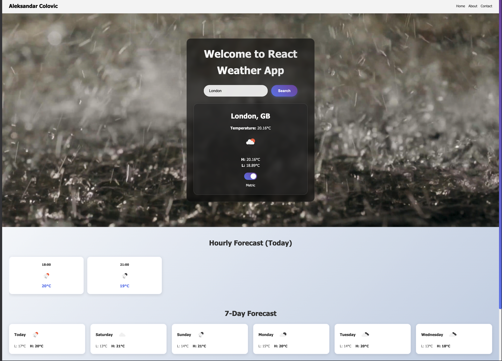

# React Weather App 🌤️

A simple React weather application built with **Vite** that allows users to search for a city and view the current weather, hourly forecast, and 7-day forecast with dynamic background videos based on the weather conditions.

---

## Features

- Search weather by city
- Current weather display with temperature, highs/lows, and weather icon
- Hourly forecast for today
- 7-day forecast
- Toggle between Celsius and Fahrenheit
- Dynamic background video based on weather: Clear, Rain, Snow
- User-friendly error handling for invalid cities or network issues

---

## Demo
This is demo screenshot: 

---

## Tech Stack

- React + Vite
- JavaScript (ES6+)
- CSS
- OpenWeatherMap API

---

## Getting Started

### Prerequisites

- Node.js (v16+ recommended)
- npm or yarn

### Installation

1. Clone the repository:

```bash
git clone https://github.com/yourusername/react-weather-app.git
cd react-weather-app# React-Weather-App
